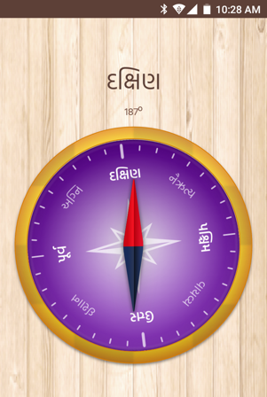

# Hokayantra (હોકાયંત્ર)

Android Application which display direction in Gujarati using gyroscope sensor of the device.

## How to build

Clone the repo. to local folder, open Android Studio and import the project.

### LICENCE

User this project whatever way you like but you need to republish it online with same LICENSE, Read the [LICENCE](LICENSE) file included in project for more information.

### Contact
shoot email to support@eseva.online
